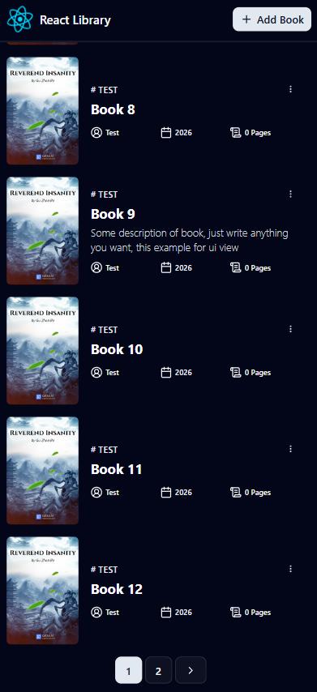
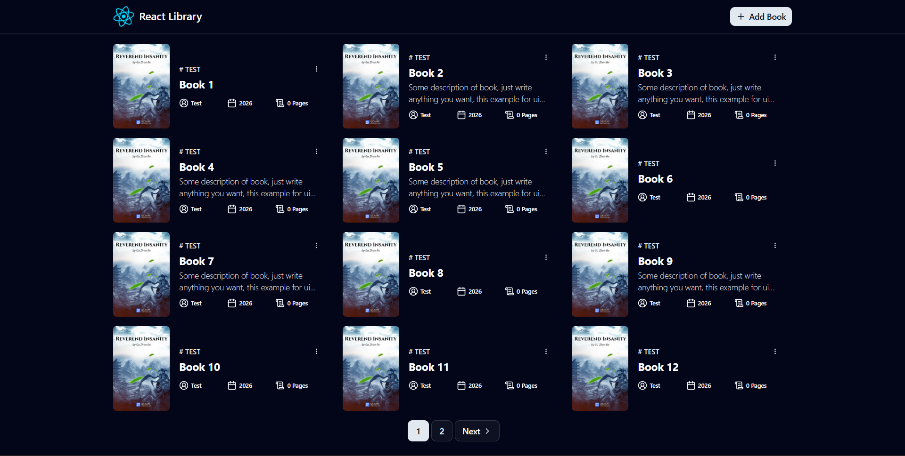
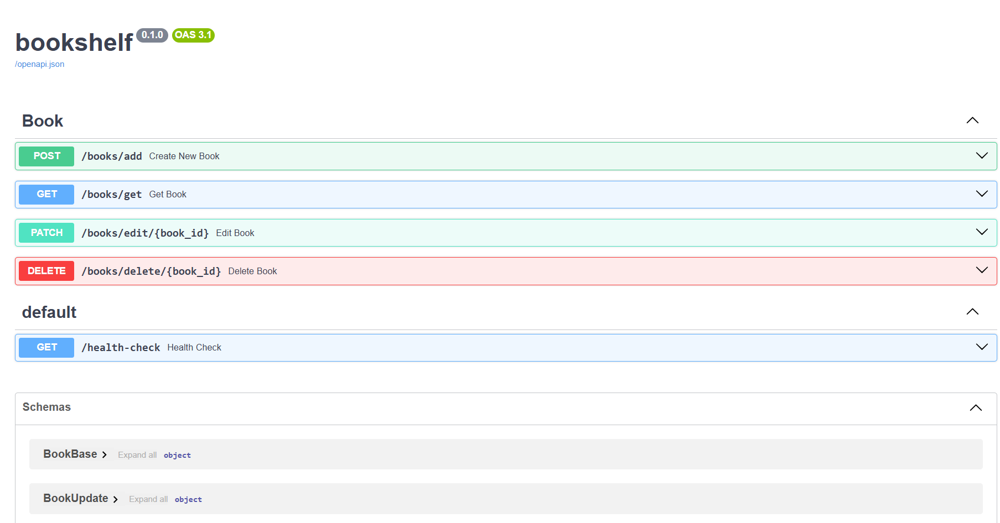

# Bookshelf Project

## Requirements

- [MySQL v8.0.44 ](https://www.mysql.com/): You'll need this running locally for now. I haven't added it to the Docker Compose yet, though it's a straightforward fix if you'd rather run it there..

## Technology Stack and Features

- ⚡ [**FastAPI**](https://fastapi.tiangolo.com) for the Python backend API.
  - 🧰 [SQLModel](https://sqlmodel.tiangolo.com) for the Python SQL database interactions (ORM).
  - 🔍 [Pydantic](https://docs.pydantic.dev), used by FastAPI, for the data validation and settings management.
  - 💾 [MySQL](https://www.mysql.com/) as the SQL database.
- 🚀 [React](https://react.dev) for the frontend.
  - 💃 Using TypeScript [Vite](https://vitejs.dev), and other parts of a modern frontend stack.
  - 🎨 [Tailwind CSS](https://tailwindcss.com) and [shadcn/ui](https://ui.shadcn.com) for the frontend components.
- 🐋 [Docker Compose](https://www.docker.com) for development and production.

### Homepage - Mobile

[](https://github.com/dhaboav/bookshelf)

The book cover is currently hardcoded, using the cover art from the web novel Reverend Insanity by Gu Zhen Ren.

[](https://www.webnovel.com/book/reverend-insanity_7996858406002505)

### Homepage - PC

[](https://github.com/dhaboav/bookshelf)

### Interactive API Documentation

The API documentation is automatically generated by FastAPI and can be accessed at http://localhost:8000/docs.
[](https://github.com/dhaboav/bookshelf)

## How To Use It

You can **just fork or clone** this repository and use it as is.

### Configure

You can then update configs in the `.env` files to customize your configurations.

### How to Run with Docker Compose

If you want to run the project in your computer with completes workflow (frontend + backend). You could follow this guide.

- Build docker image:
```bash
docker compose build
```

- Run docker container:
```bash
docker compose up
```

- Close docker container app:
```bash
docker compose down
```

## Backend Development

Backend docs: [backend/README.md](./backend/README.md).

## Frontend Development

Frontend docs: [frontend/README.md](./frontend/README.md).

## License

The bookshelf is licensed under the terms of the MIT license.