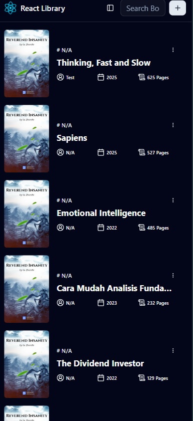
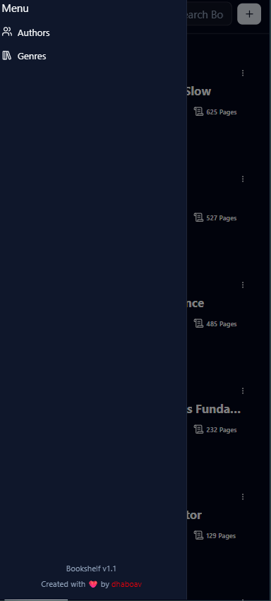
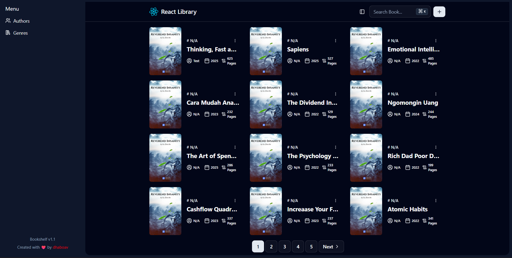
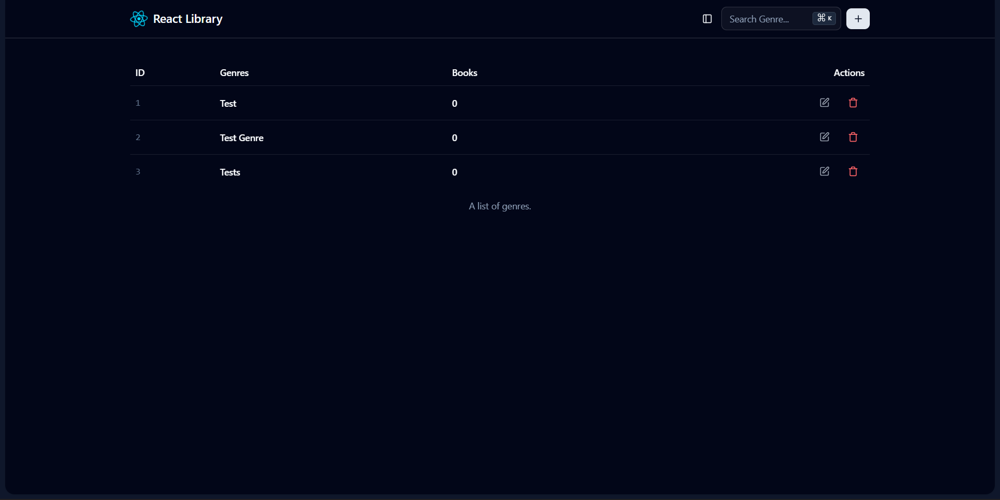
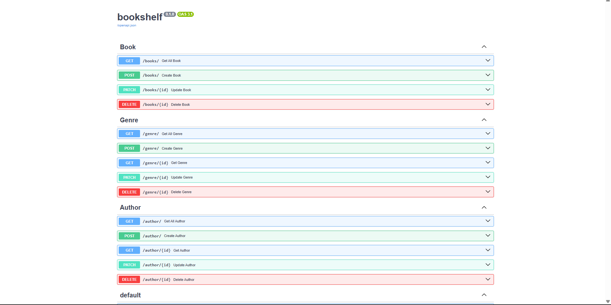

# Bookshelf Project

A friendly, digital library assistant that helps you turn your physical stack of books into an organized digital collection. You can easily add your favorite authors, categorize books by genres, and find any book instantly using the search tool.

## Requirements

Before you start, make sure you have installed:
- [Docker](https://www.docker.com) (The magic software that bundles and runs the whole app automatically).

## The Tech Ingredients

We built this project using some of the coolest tools in web development, split into three main parts:

### 1. The Frontend (The Face 🌐)
This is the beautiful screen you see and click on.
* **React & TypeScript** — The building blocks used to create our pages.
* **Vite** — The super-fast engine that runs our local code.
* **Tailwind CSS & shadcn/ui** — The styling paintbrush that makes everything look modern and clean.
* **TanStack (Query & Router)** — The smart glue that connects our screens together and fetches data smoothly.

### 2. The Backend (The Brain 🧠)
This works silently in the background, making sure all data calculations are correct.
* **FastAPI** — A lightning-fast Python framework that acts as the communication bridge.
* **SQLModel & Pydantic** — The smart assistants that check and organize our data safely.

### 3. The Database (The Memory Vault 💾)
* **MySQL** — The permanent filing cabinet where all your books, authors, and genres are safely stored.

## App Previews

### 🎨 Credit Note
The book cover art is currently using the placeholder artwork from the web novel *Reverend Insanity* by Gu Zhen Ren.
[](https://www.webnovel.com/book/reverend-insanity_7996858406002505)

### 📱 Mobile View
| Homepage | Authors & Genres |
| :---: | :---: |
|  |  |
|  | *(Smoothly adapts to fit small screens!)* |

### 💻 Desktop / PC View



### 🔍 Interactive API Dashboard
FastAPI automatically builds an interactive playground where you can test how the data engine works. You can view it live at **http://localhost:8000/docs** after starting the backend.


## How To Use It

You can **fork or clone** this repository to make it your own!

### 1. Configure Your Settings
Create a `.env` file in your root folder using our template to set up your database passwords and connection keys safely.

### 2. Start the App (The Full Setup)
We use **Docker Compose** so you can start both the frontend and backend with simple commands:

* **Build the project tools:**
  ```bash
  docker compose build
  ```

* **Wake up the entire application:**
  ```bash
  docker compose up
  ```
  
* **Put the app to sleep safely when done:**
  ```bash
  docker compose down
  ```

## Deep Dive Documentation

Want to work on specific parts of the project? Check out our dedicated guidebooks:

- 🌐 Frontend Coding: [frontend/README.md](./frontend/README.md)
- 🧠 Backend Coding: [backend/README.md](./backend/README.md)

## License

This project is open-source and free to customize under the **MIT License**.
