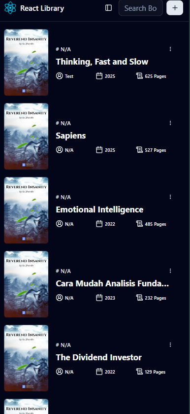
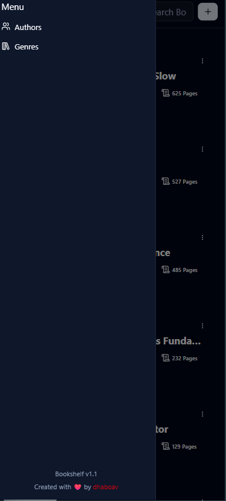
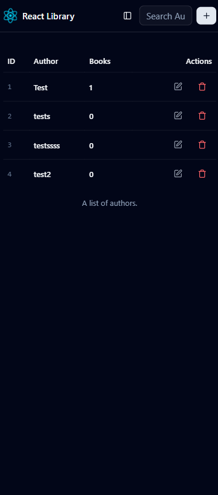
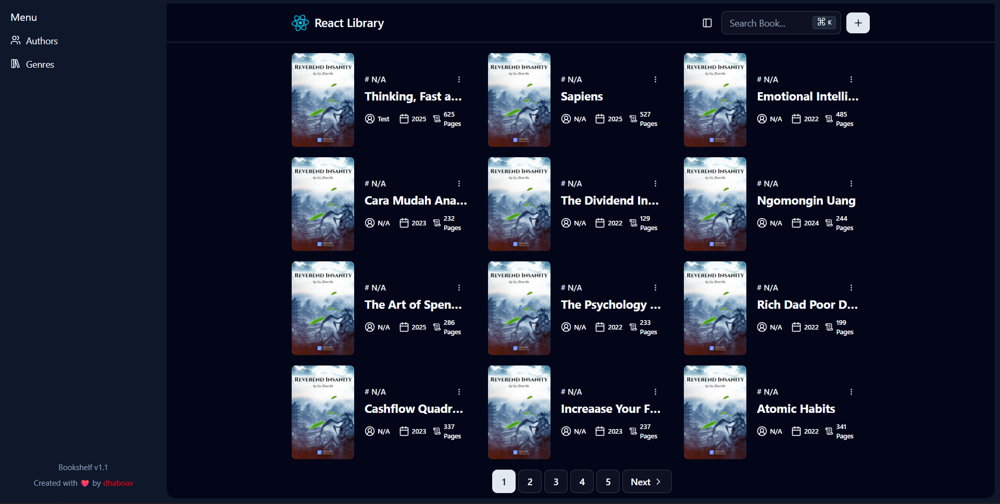
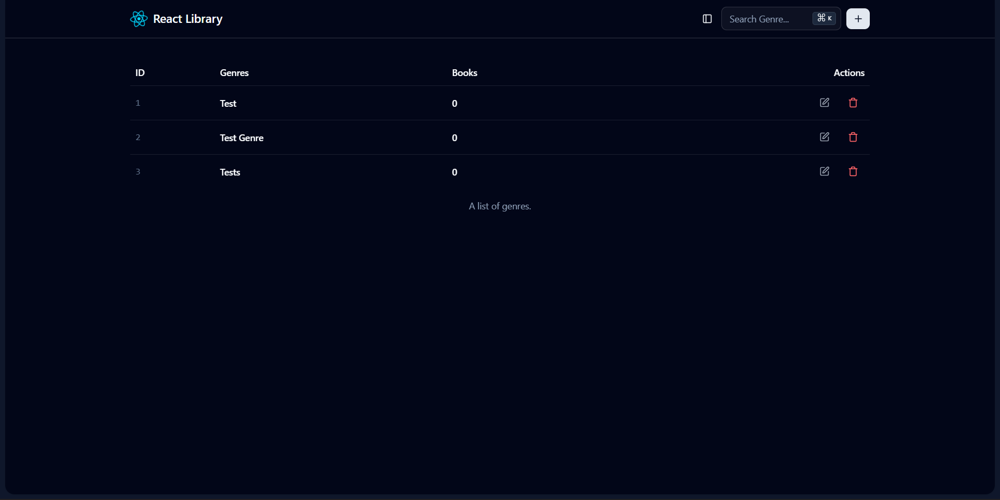
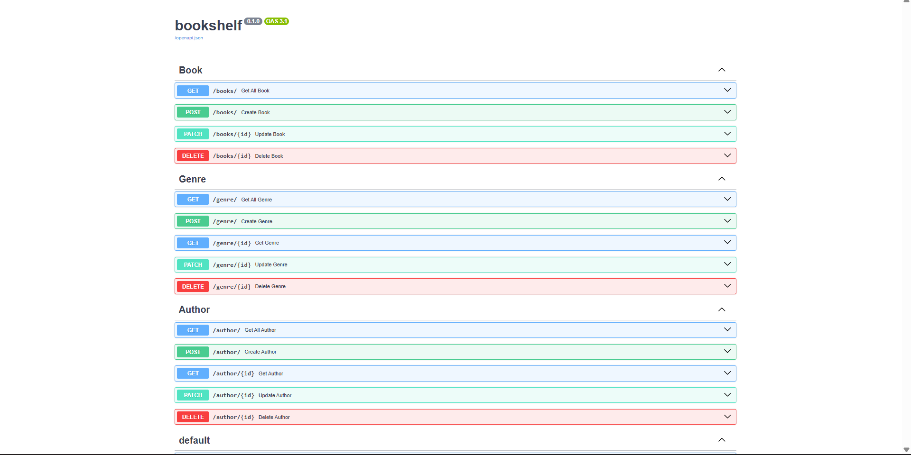

# Bookshelf Project

A full-stack digital library management application designed to organize physical book collections, track authors, categorize genres, and search items efficiently.

## Tech Stack

- **Frontend:** React, Typescript, Vite, Tailwind CSS, shadcn/ui, TanStack Query & Router.
- **Backend:** FastAPI, SQLModel, Pydantic.
- **Database:** MySQL.

## Getting Started

### Prerequisites

- [Docker](https://www.docker.com) installed on your system.

### Quick Setup

Choose how you want to run or deploy the project based on your workflow:

#### Production-Ready (Docker Compose)

Best for running the complete, containerized application stack out-of-the-box.

1. Copy the env example file and update it with your credentials:
    ```bash
    cp .env.example .env
    ```
2. Build the project with docker compose:
    ```bash
    docker compose build
    ```
3. Wake up the entire app (add `-d` to run in the background, or omit it to view live logs):
    ```bash
    docker compose up
    ```
4. Put the app to sleep safely when done:
    ```bash
    docker compose down
    ```
#### Development Environment (Dev Containers)

Best for active development and local iteration, providing hot-reloading, a pre-configured VS Code/Codespaces workspace, and a standalone database.

- Follow the step-by-step instructions in [.devcontainer/README.md](./.devcontainer/README.md)

## Deep Dive Documentation

Explore specific component guides, environment setups, and local workflows:

- 🐳 Dev Container: [.devcontainer/README.md](./.devcontainer/README.md)
- 🌐 Frontend Coding: [frontend/README.md](./frontend/README.md)
- 🧠 Backend Coding: [backend/README.md](./backend/README.md)

## App Previews

### 🎨 Credit Note
The book cover art is currently using the placeholder artwork from the web novel *Reverend Insanity* by Gu Zhen Ren.
[](https://www.webnovel.com/book/reverend-insanity_7996858406002505)

### 📱 Mobile View
| Homepage | Authors & Genres |
| :---: | :---: |
|  |  |
|  | *(Smoothly adapts to fit small screens!)* |

### 💻 Desktop / PC View



### 🔍 Interactive API Dashboard
FastAPI automatically builds an interactive playground where you can test how the data engine works. You can view it live at **http://localhost:8000/docs** after starting the backend.


## License

This project is open-source and available under the **MIT License**.
